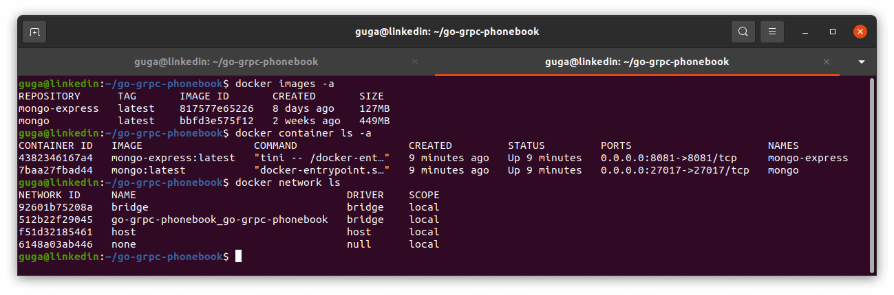
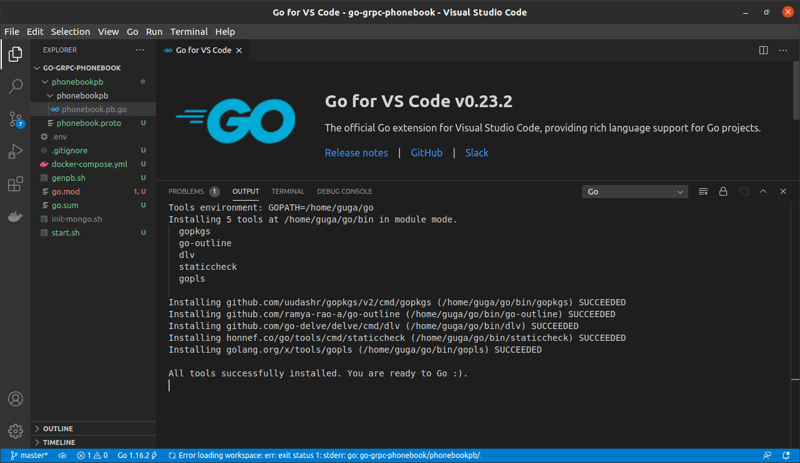

# Phone Book with GO, gRPC, Protobuf, Docker And MongoDB

## Install GO

In a Ubuntu fresh install you will need to install GO (https://golang.org/doc/install):


## Install Protoc Compiler

Go to https://github.com/protocolbuffers/protobuf/releases to see the current version.

If you don't have CURL installed - `sudo apt-get install curl`

```Bash
curl -OL https://github.com/protocolbuffers/protobuf/releases/download/v3.15.6/protoc-3.15.6-linux-x86_64.zip

unzip protoc-3.15.6-linux-x86_64.zip -d protoc3

sudo mv protoc3/bin/* /usr/local/bin/

sudo mv protoc3/include/* /usr/local/include/

sudo chown $USER /usr/local/bin/protoc

sudo chown -R $USER /usr/local/include/google

protoc --version

```


## Install Visual Studio Code and Extensions

Download from https://code.visualstudio.com/Download and install `sudo apt-get install ./code_1.54.3-1615806378_amd64.deb`

You can also add some extensions: Go, vscode-proto3 and Clang-Format.

(To format a .proto document in VSCode I also need to install `sudo apt install clang-format`)


## Install Docker

First, update your existing list of packages:

```Bash
sudo apt update
```

Next, install a few prerequisite packages which let apt use packages over HTTPS:

```Bash
sudo apt install apt-transport-https ca-certificates curl software-properties-common
```

Then add the GPG key for the official Docker repository to your system:

```Bash
curl -fsSL https://download.docker.com/linux/ubuntu/gpg | sudo apt-key add -
```

Add the Docker repository to APT sources:

```Bash
sudo add-apt-repository "deb [arch=amd64] https://download.docker.com/linux/ubuntu focal stable"
```

Next, update the package database with the Docker packages from the newly added repo:

```Bash
sudo apt update
```

Finally, install Docker:

```Bash
sudo apt install docker-ce
```

Add your user to the docker group:

```Bash
sudo usermod -aG docker ${USER}
```

To apply the new group membership type the following:

```Bash
su - ${USER}
```

Now to see if docker install is ok, run

```Bash
docker run hello-world
```


## Install Docker Compose

You can find the current release in: https://github.com/docker/compose/releases

Download the release:

```Bash
sudo curl -L "https://github.com/docker/compose/releases/download/1.28.5/docker-compose-$(uname -s)-$(uname -m)" -o /usr/local/bin/docker-compose
```

Make executable:

```Bash
sudo chmod +x /usr/local/bin/docker-compose
```


## Phone Book Project

Let's create a project from your home folder, init a Go Module (we are not running inside GO's default project folder), install Protobuf (https://github.com/golang/protobuf) and gRPC-Go (https://github.com/grpc/grpc-go):

```Bash
cd ~ && mkdir go-grpc-phonebook && cd go-grpc-phonebook

go mod init go-grpc-phonebook

go get -u github.com/golang/protobuf/{proto,protoc-gen-go}

go get -u google.golang.org/grpc

echo 'export PATH=$PATH:$HOME/go/bin' >> $HOME/.bashrc

echo 'export PATH=$PATH:/usr/local/go/bin' >> $HOME/.bashrc

source $HOME/.bashrc

```


SNAPSHOT 1

### MongoDB and Mongo Express in a Docker Container

create `docker-compose.yml` (VSCode may ask for some extensions, like Docker and YAML, just install)

```Docker
version: "3"
services:
  mongo-express:
    image: mongo-express:latest
    container_name: mongo-express
    restart: unless-stopped
    ports:
      - 8081:8081
    env_file: .env
    environment:
      ME_CONFIG_MONGODB_PORT: 27017
      ME_CONFIG_MONGODB_ADMINUSERNAME: $MONGO_USERNAME
      ME_CONFIG_MONGODB_ADMINPASSWORD: $MONGO_PASSWORD
      ME_CONFIG_BASICAUTH_USERNAME: $MONGO_USERNAME
      ME_CONFIG_BASICAUTH_PASSWORD: $MONGO_PASSWORD
    networks:
      - go-grpc-phonebook

  mongo:
    image: mongo:latest
    container_name: mongo
    restart: unless-stopped
    env_file: .env
    environment:
      MONGO_INITDB_ROOT_USERNAME: $MONGO_USERNAME
      MONGO_INITDB_ROOT_PASSWORD: $MONGO_PASSWORD
      MONGO_INITDB_DATABASE: $MONGO_DB
    ports:
      - 27017:27017
    expose:
      - 27017
    volumes:
      - dbdata:/data/db
      - ./init-mongo.sh:/docker-entrypoint-initdb.d/init-mongo.sh:ro
    networks:
      - go-grpc-phonebook

networks:
  go-grpc-phonebook:
    driver: bridge

volumes:
  dbdata:

```

I like to create a `start.sh` file to handle the docker MongoDB:

```bash
#!/bin/bash

read -p "Type the USERNAME [phonebook_user]: " MONGO_USERNAME
MONGO_USERNAME=${MONGO_USERNAME:-phonebook_user}
echo $MONGO_USERNAME

read -p "Type the PASSWORD [phonebook_pwd]: " MONGO_PASSWORD
MONGO_PASSWORD=${MONGO_PASSWORD:-phonebook_pwd}
echo $MONGO_PASSWORD

MONGO_DB=phonebookdb

if [[ -z "${MONGO_USERNAME}" || -z "${MONGO_PASSWORD}" || -z "${MONGO_DB}" ]]; then
 echo "required inputs misssing"
 exit 1
fi

echo "CREATING .env FILE..."
cat > .env <<EOF
MONGO_USERNAME=${MONGO_USERNAME}
MONGO_PASSWORD=${MONGO_PASSWORD}
MONGO_DB=${MONGO_DB}
EOF
echo "created..."

echo "CREATING init-mongo.sh FILE..."
cat > init-mongo.sh <<EOF
#!/usr/bin/env bash

echo 'Creating application user and db';

mongo ${MONGO_DB} \
 --username ${MONGO_USERNAME} \
 --password ${MONGO_PASSWORD} \
 --authenticationDatabase admin \
 --host localhost \
 --port 27017 \
 --eval "db.createUser({user: '${MONGO_USERNAME}', pwd: '${MONGO_PASSWORD}', roles:[{role:'dbOwner', db: '${MONGO_DB}'}]});"

echo 'User: ${MONGO_USERNAME} create to database ${MONGO_DB}';

mongo testDB \
 --username ${MONGO_USERNAME} \
 --password ${MONGO_PASSWORD} \
 --authenticationDatabase admin \
 --host localhost \
 --port 27017 \
 --eval "db.createUser({user: '${MONGO_USERNAME}', pwd: '${MONGO_PASSWORD}', roles:[{role:'dbOwner', db: 'testDB'}]});"

echo 'User: ${MONGO_USERNAME} create to database testDB';
EOF
echo "created..."

exit 0

```

Now run `chmod +x start.sh` to make start.sh into a executable and run `./start.sh`


If you keep the default we will have MongoDB user: phonebook_userand and MongoDB password: phonebook_pwd.

This will generate the file `init-mongo.sh` that MongoDB will use at start, and the env file `.env` with username, password and database.

Once we run this file and generate the .env and the init, we don't need to run it anymore.

So run `docker-compose up` to pull the images and start the container.




Open `http://localhost:8081/` to access Mongo Express.

Create a file `.gitignore` and add

```
.env
init-mongo.sh
```

Now we will not send files with password to github.

# Phone Book Project

First we will create a simple `.proto` with the phonebook... In this file we will have a Person, with id, name and email, and each person can have one or more phones with number and type. And for the type we need just mobile, home or work. And a good thing to have is the date that the information was last updated.

`phonebookpb/phonebook.proto`

```Protobuf
syntax = "proto3";

package phonebook;

option go_package = "phonebookpb/phonebookpb";

import "google/protobuf/timestamp.proto";

message Person {
 string id = 1;
 string name = 2;
 string email = 3;

 enum PhoneType {
 MOBILE = 0;
 HOME = 1;
 WORK = 2;
 }

 message PhoneNumber {
 string number = 1;
 PhoneType type = 2;
 }

 repeated PhoneNumber phones = 4;
 google.protobuf.Timestamp last_updated = 5;
}

service PhoneBookService {};
```

After crate the `.proto` we need to generate the code, so we can run:

```Bash
protoc phonebookpb/phonebook.proto --go_out=plugins=grpc:.
```

And since we will run this command line more times, let's create a `genpb.sh`, run `chmod +x genpb.sh` to make a executable and run `./genpb.sh`.

`genpb.sh`

```bash
#!/bin/bash

protoc phonebookpb/phonebook.proto --go_out=plugins=grpc:.

```

The file `phonebookpb/phonebookpb/phonebook.pb.go` was created with protoc, and we don't need it on github too, so add in `.gitignore` -> `*.pb.go`.

When you first open `phonebookpb/phonebookpb/phonebook.pb.go` in VSCode, you will see a popup to install `gopls`, and in the bootom right a warning about Analysis Tools Missing, just install everything.



Take this time and run `go get all` in the terminal.

The next step is create the server file `server/server.go`:

```Go
package main

import (
	"fmt"
	"go-grpc-phonebook/phonebookpb/phonebookpb"
	"log"
	"net"
	"os"
	"os/signal"

	"google.golang.org/grpc"
)

type server struct{}

func main() {
	// log if go crash, with the file name and line number
	log.SetFlags(log.LstdFlags | log.Lshortfile)

	l, err := net.Listen("tcp", "0.0.0.0:50051")
	if err != nil {
		log.Fatalf("Failed to listen: %v", err)
	}
	opts := []grpc.ServerOption{}
	s := grpc.NewServer(opts...)
	phonebookpb.RegisterPhoneBookServiceServer(s, &server{})

	// start a GO Routine
	go func() {
		fmt.Println("PhoneBook Server Started...")
		if err := s.Serve(l); err != nil {
			log.Fatalf("Failed to start server: %v", err)
		}
	}()

	// wit to exit (Ctrl+C)
	ch := make(chan os.Signal, 1)
	signal.Notify(ch, os.Interrupt)

	// block the channel until the signal is received
	<-ch
	fmt.Println("Stopping PhoneBook Server...")
	s.Stop()
	fmt.Println("Closing Listener...")
	l.Close()
	fmt.Println("All done!")
}

```

In this this file we start a listener to localhost in port 50051 (gRPC default), create the phone book service with empty options, then we start the server inside a Go Routine.

We create a channel to wait the exit command (ctrl+c), and when we receive it we stop everyting.

We also use log.SetFlags, so if we have some problem we can log it with the file name and line se will be easy to debug.


Now we will install the MongoDB Go Driver (https://github.com/mongodb/mongo-go-driver), and a way to get the data from the `.env` file (github.com/joho/godotenv)

```Bash
go get go.mongodb.org/mongo-driver/mongo

go get github.com/joho/godotenv

```


Since this is just a small example I will use everything in the same file.

We will need to get the username, password and database name from the `.env` file, than we need to connect MongoDB.

The collection will be global, so need to be outside the main()

```Go
// make collection global
var collection *mongo.Collection

...

// get env vars
err := godotenv.Load(".env")
if err != nil {
	log.Fatalf("Error loading .env file")
}
mongoUsername := os.Getenv("MONGO_USERNAME")
mongoPassword := os.Getenv("MONGO_PASSWORD")
mongoDb := os.Getenv("MONGO_DB")

// create the mongo context
mongoCtx, cancel := context.WithTimeout(context.Background(), 10*time.Second)
defer cancel()

// connect MongoDB
mongoUri := fmt.Sprintf("mongodb://%s:%s@localhost:27017", mongoUsername, mongoPassword)
fmt.Println("Connecting to MongoDB...")
client, err := mongo.Connect(mongoCtx, options.Client().ApplyURI(mongoUri))
if err != nil {
	log.Fatalf("Error Starting MongoDB Client: %v", err)
}

collection = client.Database(mongoDb).Collection("phoneBook")

...

fmt.Println("Closing MongoDB...")
client.Disconnect(mongoCtx)

```

The server file now will be like this:

```Go
package main

import (
	"context"
	"fmt"
	"go-grpc-phonebook/phonebookpb/phonebookpb"
	"log"
	"net"
	"os"
	"os/signal"
	"time"

	"github.com/joho/godotenv"
	"go.mongodb.org/mongo-driver/mongo"
	"go.mongodb.org/mongo-driver/mongo/options"
	"google.golang.org/grpc"
)

// make collection global
var collection *mongo.Collection

type server struct{}

func main() {
	// log if go crash, with the file name and line number
	log.SetFlags(log.LstdFlags | log.Lshortfile)

	// get env vars
	err := godotenv.Load(".env")
	if err != nil {
		log.Fatalf("Error loading .env file")
	}
	mongoUsername := os.Getenv("MONGO_USERNAME")
	mongoPassword := os.Getenv("MONGO_PASSWORD")
	mongoDb := os.Getenv("MONGO_DB")

	// create the mongo context
	mongoCtx, cancel := context.WithTimeout(context.Background(), 10*time.Second)
	defer cancel()

	// connect MongoDB
	mongoUri := fmt.Sprintf("mongodb://%s:%s@localhost:27017", mongoUsername, mongoPassword)
	fmt.Println("Connecting to MongoDB...")
	client, err := mongo.Connect(mongoCtx, options.Client().ApplyURI(mongoUri))
	if err != nil {
		log.Fatalf("Error Starting MongoDB Client: %v", err)
	}

	collection = client.Database(mongoDb).Collection("phoneBook")

	fmt.Println("Starting Listener...")
	l, err := net.Listen("tcp", "0.0.0.0:50051")
	if err != nil {
		log.Fatalf("Failed to listen: %v", err)
	}
	opts := []grpc.ServerOption{}
	s := grpc.NewServer(opts...)
	phonebookpb.RegisterPhoneBookServiceServer(s, &server{})

	// Start a GO Routine
	go func() {
		fmt.Println("PhoneBook Server Started...")
		if err := s.Serve(l); err != nil {
			log.Fatalf("Failed to start server: %v", err)
		}
	}()

	// Wait to exit (Ctrl+C)
	ch := make(chan os.Signal, 1)
	signal.Notify(ch, os.Interrupt)

	// Block the channel until the signal is received
	<-ch
	fmt.Println("Stopping PhoneBook Server...")
	s.Stop()
	fmt.Println("Closing Listener...")
	l.Close()
	fmt.Println("Closing MongoDB...")
	client.Disconnect(mongoCtx)
	fmt.Println("All done!")
}

```

# Create Person

Back to the `phonebookpb/phonebook.proto` file, we need to add the request and response messages and create the rpc service

```Protobuf
...

message PersonRequest { Person person = 1; }

message PersonResponse { Person person = 1; }

service PhoneBookService {
  rpc CreatePerson(PersonRequest) returns (PersonResponse) {};
};

```

Generate the code!

Back to `server/server.go` we need the function CreatePerson where we will receive the request, transform into a personItem, store into the database, receive the ID, and then send the response to the client.

```Go
func (*server) CreatePerson(ctx context.Context, req *phonebookpb.PersonRequest) (*phonebookpb.PersonResponse, error) {
	person := req.GetPerson()
	fmt.Printf("CreatePerson called with: %v\n", person)
	data := personItem{
		Name:        person.GetName(),
		Email:       person.GetEmail(),
		Phones:      person.GetPhones(),
		LastUpdated: timestamppb.Now(),
	}
	res, err := collection.InsertOne(context.Background(), data)
	if err != nil {
		return nil, status.Errorf(codes.Internal, fmt.Sprintf(" Internal Error: %v", err))
	}
	oid, ok := res.InsertedID.(primitive.ObjectID)
	if !ok {
		return nil, status.Errorf(codes.Internal, "Cannot convert to OID")
	}
	data.ID = oid
	return &phonebookpb.PersonResponse{
		Person: &phonebookpb.Person{
			Id:          data.ID.Hex(),
			Name:        data.Name,
			Email:       data.Email,
			Phones:      data.Phones,
			LastUpdated: data.LastUpdated,
		},
	}, nil
}

```

We need a personItem struct, and we just need it to receive the Id from MongoDB right, so let's create it bellow `var collection *mongo.Collection`:

```Go
type personItem struct {
	ID          primitive.ObjectID                `bson:"_id,omitempty"`
	Name        string                            `bson:"name"`
	Email       string                            `bson:"email"`
	Phones      []*phonebookpb.Person_PhoneNumber `bson:"phones"`
	LastUpdated *timestamppb.Timestamp            `bson:"last_updated,omitempty"`
}
```

We need a Client, so let's create `client/client.go`. In this file we do a insecure dial to localhost 50051 (your server without SSL), put a defer close to finish when done, and then start the service client. To create a new person inside your PhoneBook, we need the function `createPerson` to create the person object and send to the server.

```Go
package main

import (
	"context"
	"fmt"
	"go-grpc-phonebook/phonebookpb/phonebookpb"
	"log"

	"google.golang.org/grpc"
)

func main() {
	fmt.Println("Starting Client...")
	cc, err := grpc.Dial("localhost:50051", grpc.WithInsecure())
	if err != nil {
		log.Fatalf("Could not connect: %v", err)
	}
	defer cc.Close()
	c := phonebookpb.NewPhoneBookServiceClient(cc)

	createPerson(c)
}

func createPerson(c phonebookpb.PhoneBookServiceClient) {
	fmt.Println("Creating the person...")
	person := &phonebookpb.Person{
		Name:  "Guga Zimmermann",
		Email: "gugazimmermann@gmail.com",
		Phones: []*phonebookpb.Person_PhoneNumber{
			{
				Number: "+55 47 98870-4247",
				Type:   phonebookpb.Person_MOBILE,
			},
			{
				Number: "+55 47 XXXXX-XXXX",
				Type:   phonebookpb.Person_HOME,
			},
		},
	}
	res, err := c.CreatePerson(context.Background(), &phonebookpb.PersonRequest{Person: person})
	if err != nil {
		fmt.Printf("Error while creating the person: %v\n", err)
	}
	fmt.Printf("Person Created: %v\n", res)
}

```

Open two terminal windows, in one you can start the server `go run server/server.go` and on the other the client `go run client/client.go`.


And if you open the Browser and go to `http://localhost:8081` (mongo express), you can see the collection, and inside the new person:


# Read Person

`.proto`

```Protobuf
message ReadPersonRequest { string person_id = 1; }

message ReadPersonResponse { Person person = 1; }

```

inside `PhoneBookService`

```Protobuf
rpc ReadPerson(ReadPersonRequest) returns (ReadPersonResponse) {};
```

SERVER: We receive the person ID request, transform in a mongoDB objectID, try to findOne in mongoDB, and then return the Person as a response.

```Go
func (*server) ReadPerson(ctx context.Context, req *phonebookpb.ReadPersonRequest) (*phonebookpb.ReadPersonResponse, error) {
	personId := req.GetPersonId()
	fmt.Printf("ReadPerson called with: %v\n", personId)

	oid, err := primitive.ObjectIDFromHex(personId)
	if err != nil {
		return nil, status.Errorf(codes.InvalidArgument, fmt.Sprintf("Cannot parse ID"))
	}

	data := &personItem{}
	res := collection.FindOne(context.Background(), primitive.M{"_id": oid})
	if err := res.Decode(data); err != nil {
		return nil, status.Errorf(codes.NotFound, fmt.Sprintf("Cannot found person with the specified ID: %v", err))
	}

	return &phonebookpb.ReadPersonResponse{
		Person: &phonebookpb.Person{
			Id:     data.ID.Hex(),
			Name:    data.Name,
			Email:    data.Email,
			Phones:   data.Phones,
			LastUpdated: data.LastUpdated,
		},
	}, nil

}

```

CLIENT:  Very simple,  just send the  ID as a string to the client and wait the result.

```Go
func readPerson(c phonebookpb.PhoneBookServiceClient) {
	// CHANGE TO THE ID THAT YOU RECEIVED WHEN CREATE THE PERSON
	// YOU CAN TRY 605812e409be8dac8d59b5af TO SEE code = NotFound
	// AND xxxx TO SEE code = InvalidArgument
	personId := "605805238428bbcb74e710df"
	fmt.Printf("Reading person with ID: %v\n", personId)
	res, err := c.ReadPerson(context.Background(), &phonebookpb.ReadPersonRequest{PersonId: personId})
	if err != nil {
		fmt.Printf("Error while reading the person: %v\n", err)
	}
	fmt.Printf("Person: %v\n", res)
}
```


# Update Person

